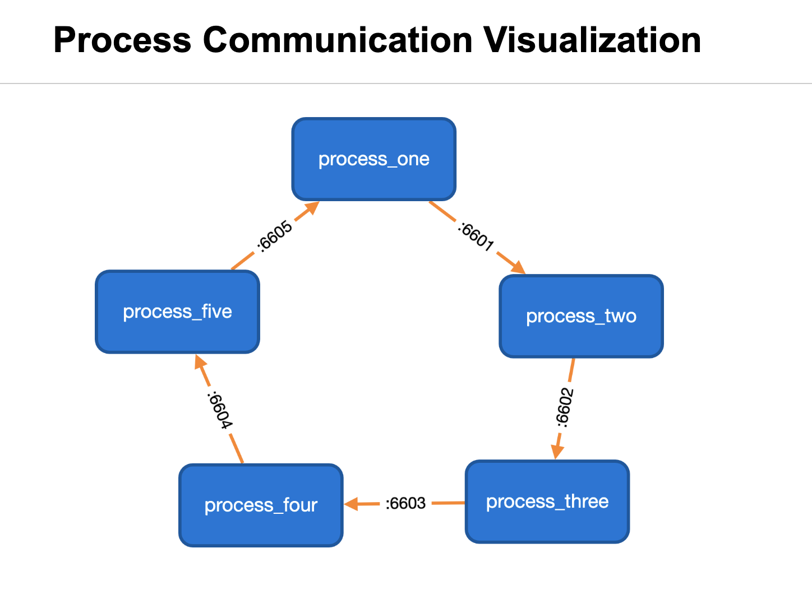

# procmap
Create a Cytoscape block diagram of processes and their TCP connections.

## Usage:

* Provide a list of process names in config.json
* Start app.py
* Open: http://localhost:5001/

### Sample

